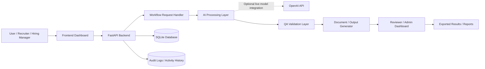

# TraceMind AI

TraceMind AI is a professional AI portfolio project that turns workflow requirements into structured QA and documentation outputs. It is built to demonstrate practical AI-assisted workflow automation, clean project organization, clear documentation, and recruiter-friendly software presentation without using real private data, credentials, or sensitive records.

## Short Summary

TraceMind AI takes one requirement and generates a polished review package that includes workflow test coverage, edge cases, failure modes, traceability, issue-template guidance, exportable artifacts, and a concise audit summary. The project is intentionally local-first, easy to run, and designed to communicate software quality thinking in under two minutes.

## Why This Project Matters

- Demonstrates practical AI-assisted workflow automation instead of abstract AI claims
- Shows clean repository structure and professional documentation habits
- Highlights QA, testing, traceability, and automation thinking in one demo
- Gives recruiters and hiring managers a fast way to assess product, frontend, backend, and presentation skills
- Uses safe mock data only, with no real client data, secrets, or production credentials

## Key Features

- Requirement-to-review generation flow powered by FastAPI and a React frontend
- Structured output set including test cases, edge cases, negative scenarios, risk notes, and traceability
- Client-side TXT and CSV exports for demo-ready presentation
- Local sample fallback when the backend is offline
- Public-safe sample data suitable for GitHub, LinkedIn, and recruiter walkthroughs
- Clear separation between demo inputs and environment configuration

## Tech Stack

- Frontend: React, Vite, JavaScript, custom CSS
- Backend: FastAPI, Python
- Storage: SQLite for optional saved analysis support
- Exports: TXT and CSV
- Tooling: ESLint, npm, virtual environments

## System Architecture

TraceMind AI is organized as a lightweight workflow platform: the frontend collects a requirement, the FastAPI backend processes it, the AI and QA layers turn it into structured artifacts, and the output layer returns review-ready results that can be saved, audited, and exported.

Full architecture notes: [`docs/architecture.md`](./docs/architecture.md)



## Project Structure

```text
TraceMind AI/
- backend/
  - app/
    - main.py
    - schemas.py
    - services/
  - data/
  - requirements.txt
- demo/
  - sample_workflow_request.json
- docs/
  - architecture.md
  - screenshots/
- frontend/
  - public/
  - src/
  - .env.example
  - package.json
- .env.example
- .gitignore
- DEMO_CHECKLIST.md
- DEMO_SCRIPT.md
- README.md
```

## Screenshots

Add screenshots to [`docs/screenshots/`](./docs/screenshots/) before publishing the final GitHub repo for maximum impact.

Suggested filenames:

- `docs/screenshots/home.png`
- `docs/screenshots/generator.png`
- `docs/screenshots/results.png`

## Demo Workflow

1. Start the backend server.
2. Start the frontend dev server.
3. Open the app in the browser.
4. Load the sample requirement or paste your own workflow requirement.
5. Generate the package and walk through the output cards.
6. Export the TXT and CSV files to show presentation and documentation quality.

## How To Run Locally

### Backend

```powershell
cd "C:\Users\lacie\Desktop\codex-project\linkedin-posts\TraceMind AI\backend"
python -m venv .venv
.\.venv\Scripts\Activate.ps1
pip install -r requirements.txt
uvicorn app.main:app --reload
```

Backend URL:

- `http://127.0.0.1:8000`

Health check:

- `http://127.0.0.1:8000/health`

### Frontend

```powershell
cd "C:\Users\lacie\Desktop\codex-project\linkedin-posts\TraceMind AI\frontend"
npm install
npm run dev -- --host 127.0.0.1 --port 5173
```

Frontend URL:

- `http://127.0.0.1:5173`

## Environment Variables

Backend example values are in [`/.env.example`](./.env.example).
Frontend example values are in [`frontend/.env.example`](./frontend/.env.example).

Backend variables:

- `TRACEMIND_DB_PATH`
- `TRACEMIND_ALLOWED_ORIGINS`
- `TRACEMIND_DEMO_MODE`

Frontend variables:

- `VITE_API_BASE_URL`

Important:

- Use placeholder values only in shared examples
- Do not commit real API keys, client credentials, private exports, or personal data
- The current demo does not require any real paid API key to run locally

## Testing / QA Approach

TraceMind AI is built to showcase QA thinking as part of the product itself.

- The app generates test cases, edge cases, failure modes, and traceability from a single requirement
- The frontend supports a fallback-safe demo path so the presentation does not break if the backend is unavailable
- TXT and CSV exports make it easy to verify consistency between visible UI content and shared artifacts
- The included sample workflow is mock-only and public-safe by design
- The project is prepared for manual smoke testing of backend startup, frontend startup, generation flow, and export behavior

## Future Improvements

- Add automated backend smoke tests and frontend interaction tests
- Add screenshot assets and a short hosted demo video
- Support saved runs and comparison views directly in the UI
- Add optional LLM-backed generation behind environment-based configuration
- Add GitHub Actions for linting, smoke checks, and build verification

## Author Information

Update this section before publishing:

- Name: `Your Name`
- GitHub: `https://github.com/your-username`
- LinkedIn: `https://www.linkedin.com/in/your-profile`
- Portfolio: `https://your-portfolio-site.example`

## Public Repo Safety

This repository is prepared to be public-facing.

- No real private client data is included
- No real credentials or API keys are included
- Environment files, caches, logs, databases, and generated artifacts are ignored
- Demo/sample data is intentionally mock-only and safe for portfolio use
