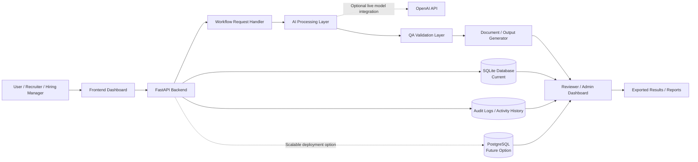

# TraceMind AI

## System Architecture

TraceMind AI is designed as a clean, portfolio-friendly workflow system that turns a single requirement into structured QA and documentation outputs. The architecture keeps the flow easy to understand: a user submits a workflow request through the frontend, the FastAPI backend processes it, the AI and QA layers shape the response, and the system returns review-ready outputs that can be stored, audited, and exported.

The current repository runs with safe mock processing and SQLite by default. The OpenAI API and PostgreSQL are shown as professional extension points so the diagram reflects both the present implementation and the intended scalable design direction.

## Component Overview

### 1. User / Recruiter / Hiring Manager

This is the portfolio audience. The architecture begins with a person evaluating the product, entering a workflow requirement, and reviewing the generated outputs.

### 2. Frontend Dashboard

The React frontend acts as the visible product surface. It collects the requirement input, submits it to the backend, and presents the resulting artifacts in a clean, recruiter-friendly interface.

### 3. FastAPI Backend

The FastAPI service is the application entry point for processing requests. It exposes health, generation, persistence, and export endpoints while keeping the architecture simple and readable.

### 4. Workflow Request Handler

This layer represents the backend request orchestration. It receives the request, validates the input shape, and routes the payload into the generation workflow.

### 5. AI Processing Layer

This is the logic layer that transforms raw requirements into structured outputs. In the current repository, this is implemented with safe mock generation logic; architecturally, it is also the right place for live model orchestration.

### 6. OpenAI API

This is an optional external integration point. It is shown to communicate how TraceMind AI could evolve from a local portfolio demo into a live AI-assisted workflow tool without changing the overall system design.

### 7. QA Validation Layer

This layer adds the project's QA identity. It shapes the output into test cases, edge cases, failure modes, risk notes, traceability, and review-oriented artifacts.

### 8. Document / Output Generator

This stage packages the processed content into structured results that are easy to read in the UI and easy to export as recruiter-friendly documentation.

### 9. SQLite Database / PostgreSQL Option

SQLite is the current storage choice in the repo and keeps the project easy to run locally. PostgreSQL is shown as a professional future option for a more scalable deployment model.

### 10. Audit Logs / Activity History

This layer represents activity tracking, saved generation history, and operational traceability. It supports the project's emphasis on reviewability and structured software workflow thinking.

### 11. Exported Results / Reports

This is the final outward-facing artifact layer. It captures the TXT and CSV style outputs that make the project feel practical and presentation-ready for GitHub, LinkedIn, and recruiter demos.

### 12. Reviewer / Admin Dashboard

This is the review surface for generated outputs, saved history, and artifacts. In the current portfolio project, this role is represented conceptually through the results-oriented UI experience rather than a separate enterprise admin product.

## Why This Architecture Works Well For Portfolio Review

- It shows clear separation between frontend, backend, processing, validation, storage, and output layers.
- It communicates that the project is organized like a real software product, not just a single script.
- It highlights practical QA thinking, which helps recruiters quickly understand the value of the project.
- It demonstrates a clean upgrade path from mock processing to live AI integration.
- It stays simple enough for fast comprehension while still looking professional on GitHub.

## Notes

- No real secrets, API keys, or private records are required for this architecture.
- The OpenAI API node is intentionally shown as an optional integration point, not a hard dependency of the current local demo.
- The architecture is designed for readability first, which is especially useful in recruiter and client-facing repository reviews.
